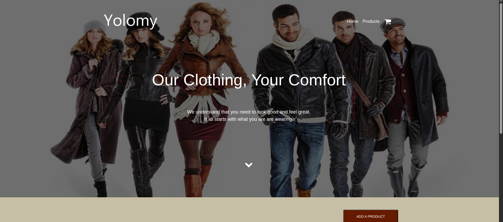

# 🛍️ YOLO E-Commerce Application

This is a full-stack e-commerce platform that functions both as a customer-facing storefront and an admin dashboard for managing products. The application is built using **React** for the frontend, **Node.js/Express** for the backend, and **MongoDB** for the database.

The project is containerized using Docker and follows a microservices architecture, making it easy to deploy and scale. It includes a `docker-compose.yml` file to manage services.

---

## 🚀 Overview

This project demonstrates:

- Microservices deployment using Docker containers
- Backend REST API for managing products
- Frontend React dashboard and product storefront
- MongoDB as the primary data store

---

## ⚙️ Tech Stack

| Layer      | Technology                       |
|------------|----------------------------------|
| Frontend   | React (Port: `3000`)             |
| Backend    | Node.js + Express (Port: `5000`) |
| Database   | MongoDB                          |
| DevOps     | Docker & Docker Compose  |

---

## 📦 Requirements

- [Docker](https://docs.docker.com/engine/install/)
- [Docker Compose](https://docs.docker.com/compose/)

---

## 🚀 How to Launch the Application

> Clone the repository and navigate into the project directory.

```bash
git clone https://github.com/mulikevs/yolo.git
cd yolo
```

### Using Docker Compose

```bash
docker-compose up --build
```

- The **backend** service will be available at: `http://localhost:5000/api/product`
- The **frontend** service will be available at: `http://localhost:3000`

---

## 📁 Project Structure

```
yolo/
├── backend/                # Express server, product API
├── client/                 # React app
├── docker-compose.yml      # Container orchestration
└── README.md
```

---

## 🧪 API Endpoints

### Base URL: `http://localhost:5000/api/product`

| Method | Endpoint       | Description              |
|--------|----------------|--------------------------|
| GET    | `/`            | Get all products         |
| POST   | `/`            | Add a new product        |
| PUT    | `/:id`         | Update a product         |
| DELETE | `/:id`         | Delete a product         |

---


## 📷 UI Preview



---

## Docker hub Images
```bash
docker pull mulikevs/mulikevs-yolo-client:v1.0.0 # frontend

docker pull mulikevs/mulikevs-yolo-client:v1.0.0 # Backend
```

## 📌 Notes

- Ensure all required ports (3000, 5000) are free before starting.
- MongoDB is running as a separate container.
- Environment variables (if any) can be set using a `.env` file or directly within Docker Compose.

---

## 🧼 Troubleshooting

- **Port conflict?** Kill any process using port 3000 or 5000.
- **Docker build errors?** Try clearing cache using `docker system prune -a`.

---

